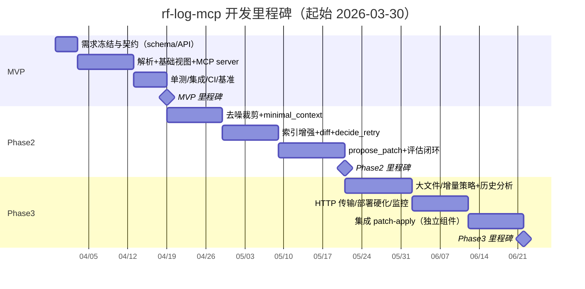

# rf-log-mcp 面向 LLM 的友好化开发计划与实施方案

## 执行摘要

本计划面向 2026-03-30 起的开发周期，目标是在 **Robot Framework 输出日志（output.xml / output.json）→ rf-log-mcp 解析与索引 → LLM 渐进式取证据 → decide_retry / propose_patch → 生成可审核补丁 → 二次运行 diff 验证** 的闭环中，显著降低 LLM 上下文负担并提升自动诊断与修复的可控性与可测性。核心工程策略为：

- **渐进式披露视图**（summary → failure_path → minimal_context/step_window → patch_suggestion → diff），默认只给最小充分证据，超长内容统一分页与截断。
- **严格 schema 契约 + 可追溯证据链**：每个视图/工具输出带 schema 版本、token 预算、ref_uri 证据引用；补丁建议必须包含风险评分与回滚策略。
- **Robot Framework 官方 API 优先**：解析 output.xml 使用 `ExecutionResult` + `ResultVisitor`，避免手写 XML 解析；JSON 输出遵循 `result.json` schema；RF7.2 起执行态可直接生成完整 JSON 输出。
- **MCP 分工明确**：Resources 用于稳定上下文；Tools 用于检索/聚合/决策/生成补丁；分页采用 MCP 规定的不透明 cursor。
- **默认 stdio 部署**：本地集成简单且 MCP 推荐；严格遵守 stdio 规范（stdout 仅输出协议消息，日志写 stderr）。

本计划分三阶段交付：**MVP（可用）→ Phase2（可修）→ Phase3（可规模化与可治理）**。每阶段提供明确里程碑、任务拆分、估时（人日）、复杂度、优先级、角色建议、验收标准、风险缓解与自动化评估方法。

---

## 目标、范围与资源假设

### 目标与度量（可验收）

| 指标 | 定义 | 目标阈值（未指定则给建议） | 验收采集方式 |
|---|---|---|---|
| token 节省 | `tokens(raw) / tokens(views)` 或会话总输入 token | summary/failure_path **≥10×**；minimal_context **≥5×**；step_window **≥2×**（建议） | MCP client 统计 token（优先使用模型/平台返回 usage；否则用 tokenizer 估算） |
| 检索延迟 | 解析后视图/检索 API P95 | P95 < **300ms**（缓存命中，建议）；首次 parse P95 < **3s/100MB**（建议，环境相关） | server 内置 metrics：`tool_latency_ms`、`cache_hit` |
| 诊断准确率 | root-cause Top-1/Top-3 | Top-1 ≥ **70%**、Top-3 ≥ **90%**（建议；若无标注集则“无特定约束”） | 评估集标注 + 自动评分脚本 |
| 修复建议命中率 | 应用补丁后二次运行通过率提升 | 通过率绝对提升 ≥ **30%** 或相对提升 ≥ **50%**（建议；无数据则“无特定约束”） | 二次运行 diff 统计 |
| 误修率 | 补丁引入新失败比例 | < **5%**（建议；无特定约束） | before/after diff + 失败签名对比 |
| 可解释性 | 每条 patch_suggestion 含证据引用、风险、回滚 | **100%（强约束）** | schema 校验（缺字段即失败） |

> “渐进式披露 + 按需检索上下文”属于主流 Agent 上下文工程实践，用以避免把无关信息塞满上下文。  
> 对 LLM 输出的补丁建议建议采用结构化输出/JSON Schema 约束，显著降低字段缺失与格式漂移风险。

### 范围（In-scope / Out-of-scope）

**In-scope（本项目负责）**

- 解析 `output.xml`、`output.json`，并构建索引与多视图输出（summary/failure_path/minimal_context/step_window/diff/patch_suggestion）。
- MCP server（stdio 优先）暴露 resources/tools/prompts；分页与缓存；性能与评估数据打点。
- decide_retry / propose_patch 工具：给出**决策建议与补丁候选**（diff），不直接写文件。

**Out-of-scope（建议拆为独立组件）**

- 自动落盘修改 `.robot` 文件与提交代码（应由独立 “patch apply” 工具/流水线步骤完成，并要有人类审核）。
- 执行 Robot 测试本身（rf-log-mcp 只消费结果文件）。
- 构建完整的 LLM agent（本项目提供工具与 prompt 模板，agent 可由调用方实现）。

### 团队资源与依赖假设

- 人员规模：**无特定约束**（本计划提供“最小团队配置建议”）。
- 语言与框架：默认 **Python**（符合 Robot Framework 官方 API 使用语境）。
- Robot Framework 版本：至少覆盖 RF7.x；JSON 执行态输出从 RF7.2 开始支持；Rebot RF7.0 起可生成 JSON，但 7.2 起 JSON 才包含完整统计与 errors。
- MCP 协议：遵循 MCP 规范（resources/tools/pagination/transports）；stdio 与 Streamable HTTP 二选一或同时支持。

---

## 技术选型与关键实现细节

### 解析与归一化：Robot Framework API 优先

**选择理由**

- 官方明确建议解析结果优先使用 Robot Framework API，配合 `ResultVisitor` 遍历 suite/test/keyword 生命周期，而非手写 XML 解析。
- `ExecutionResult` 支持从 XML 读取结果；并支持 `to_json()`；RF7.2 起 JSON 结果包含完整数据（errors、statistics）。

**实现要点**

- XML：`robot.api.ExecutionResult(path).visit(visitor)` 收集结构化结果。
- JSON：按 `result.json` schema 映射到归一化模型（suite/tests/body/messages/errors/statistics）。
- 版本兼容：  
  - RF7.0+ output.xml schema version=5，XSD 注释声明兼容 RF7.0+。  
  - JSON 输出：RF7.2 起执行态支持；RF7.0 起 Rebot 可生成 JSON，但早期 JSON 不含 errors/statistics（需显式处理）。

### MCP server：FastMCP + stdio（默认）

- MCP 规范定义标准传输：stdio 与 Streamable HTTP；并建议客户端尽可能支持 stdio。  
- stdio 规范要求：stdout 只能输出 MCP 消息；允许写 stderr 做日志；消息必须为 UTF-8 且不含内嵌换行（以换行分隔）。  
- FastMCP 用 Python 类型标注自动生成工具 schema，降低维护成本。  
- 调试工具：MCP Inspector 支持连接 stdio/HTTP，调用 tools/resources/prompts 并观察通知流，建议纳入开发流程。  

### 索引与存储技术：推荐 SQLite + FTS5（MVP 起步）

| 组件 | 推荐方案 | 优点 | 缺点 | 替代方案（优缺点） |
|---|---|---|---|---|
| 视图缓存 | 内存 LRU + 磁盘（SQLite 表） | 易实现；可跨进程复用；便于清理 | 并发写需注意锁 | Redis（快但需外部依赖；适合多实例） |
| 全文检索 | SQLite FTS5（message 倒排） | 零外部依赖；足够快；易部署 | 极大数据量性能受限 | Meilisearch/Elasticsearch（强但重） |
| 结构索引 | SQLite（run/test/node/tag 表） | 简单稳定；事务保证 | schema 迁移需要管理 | DuckDB（分析强；写入模型不同） |
| 归一化模型 | dataclasses/pydantic | 开发效率高；校验强 | pydantic 有性能成本 | msgspec（更快但学习成本） |

> 索引/检索/分页的存在是降低 token 的关键：LLM 不读全文，而是通过工具按需取证据片段（与上下文工程实践一致）。

### 视图裁剪与分页：强制执行

- MCP 分页采用 **不透明 cursor**，客户端不得假设固定页大小。  
- Resources/Tools 分工：Resources 提供“上下文数据”；Tools 提供“计算/查询/决策”。  

### 大文件风险的架构预案

Robot Framework 社区出现过超大 output.xml（例如 8.5GB）导致 `ExecutionResult` 处理被系统 kill 的讨论，说明必须设计“文件大小上限、分页、裁剪、可选增量策略”。

---

## 阶段计划、里程碑与任务分解

### 总体里程碑与建议节奏

- 迭代方式：建议 2 周一个 sprint（无特定约束），每阶段至少包含：需求冻结 → 开发 → 测试 → 性能/评估 → 文档与交付。
- 团队配置（建议最小）：  
  - 后端工程师（解析/索引/MCP）：1–2  
  - 测试工程师（fixtures/自动化/性能）：1  
  - LLM 工程师（prompt/评估/修复策略）：0.5–1  
  - SRE/DevOps（CI/CD/监控/发布）：0.5  

#### 时间线示意（可按人力调整）

> MCP 推荐 stdio 用于本地集成，HTTP 用于远程；计划中 Phase3 再补齐远程部署能力以降低早期复杂度。  

---

### MVP 阶段计划

#### MVP 目标

- 能解析 `output.xml` 与 RF7.2+ 完整 `output.json`（RF7.0/7.1 JSON 降级处理）。
- MCP stdio server 可用：资源与工具可被 Inspector 调用验证。
- 三个关键视图可用：`summary`、`failure_path`、`step_window`；基础检索 `search_messages`；所有长列表分页。
- 基础缓存与性能打点。

#### MVP 里程碑（Milestone M1）

**可交付物（Deliverables）**

- D1：归一化模型（Run/Suite/Test/Node/Message）与 XML/JSON adapter  
- D2：MCP server（FastMCP）+ stdio 启动脚本 + tools/resources 列表  
- D3：视图 v1：summary/failure_path/step_window（带 budget、ref_uri、cursor）  
- D4：工具 v1：parse_result、search_messages、get_view（可选统一入口）  
- D5：测试夹具：RF7 XML、RF7.2 JSON、RF7.0/7.1 JSON（降级）；基础单测 + 集成测  
- D6：CI（lint + unit + integration）与基准脚本（parse/视图延迟）

**验收标准（Acceptance Criteria）**

- 功能：
  - 支持 `output.xml` 解析（ExecutionResult+ResultVisitor）。  
  - 支持 `output.json` 解析（按 result.json schema 字段映射）。  
  - resources 可读取，tools 可调用，分页 cursor 生效。  
  - stdio 规范符合：stdout 不输出日志，日志写 stderr。  
- 性能（建议阈值，环境相关）：
  - 解析后视图生成 P95 < 300ms（缓存命中）。  
  - 100MB 结果文件 parse P95 < 3s（无特定约束，作为建议基线）。  
- 质量：
  - schema 校验 100% 通过（视图/工具输出均带 schema 版本）。  
  - token 预算字段存在，且超限时 `truncated=true`。

#### MVP 任务分解表

| 任务 | 说明 | 角色建议 | 估时（人日） | 复杂度 | 优先级 | 依赖 |
|---|---|---:|---:|---:|---:|---|
| 契约冻结：views/tools schema v1 | 定义 JSON schema、字段、预算、cursor、ref_uri | Tech Lead + 后端 + LLM 工程师 | 3 | 中 | 高 | 无 |
| XML 解析 adapter | ExecutionResult + ResultVisitor 收集 suite/test/kw/msg | 后端工程师 | 5 | 中 | 高 | RF API |
| JSON 解析 adapter | 按 result.json 映射；识别 RF7.0/7.1 不完整 JSON 并降级 | 后端工程师 | 4 | 中 | 高 | JSON 输出说明 |
| 归一化模型与 run_id | dataclasses/pydantic；run_id=hash(path+generated) | 后端工程师 | 3 | 中 | 高 | 无 |
| 视图：summary | 提取总统计、失败 TopK、errors TopK（若存在） | 后端工程师 | 2 | 低 | 高 | 解析完成 |
| 视图：failure_path | DFS 提取最短失败链 + message 摘要 | 后端工程师 + LLM 工程师 | 3 | 中 | 高 | 归一化模型 |
| 视图：step_window（分页） | 线性化步骤 + cursor 分页 | 后端工程师 | 3 | 中 | 高 | 分页规范 |
| 工具：parse_result | ingest、缓存、索引开关、返回 run_id 与资源 URI | 后端工程师 | 2 | 中 | 高 | MCP tools |
| 工具：search_messages（基础版） | 先做线性扫描 + 简单倒排（或 sqlite 起步） | 后端工程师 | 3 | 中 | 中 | 无 |
| MCP server（FastMCP+stdio） | tools/resources/prompts 注册；stderr logging | 后端工程师 | 2 | 中 | 高 | FastMCP |
| 测试夹具与单测 | fixtures + schema 校验 + 回归用例 | 测试工程师 | 5 | 中 | 高 | result.xsd/result.json |
| 集成测试（Inspector） | 用 MCP Inspector 调用资源/工具做冒烟测试 | 测试工程师 | 2 | 低 | 中 | Inspector |
| CI 初版 | lint/pytest/打包；输出基准报告 | SRE/DevOps | 2 | 中 | 中 | 无 |

> MVP 预计总工作量：约 **39 人日**（可按人力并行压缩日历时间）。

---

### Phase2 阶段计划

#### Phase2 目标

- 加入 `minimal_context` 视图 + **去噪裁剪**（WUKS/循环折叠、去重、level 过滤、堆栈裁剪）。
- 建立稳定索引（SQLite + FTS5）提升检索性能。
- 提供 `diff` 视图、`decide_retry` 与 `propose_patch`（输出 patch_suggestion：diff + 风险评分 + 回滚 + 证据引用）。
- 建立 3 个实验用例的自动化评估闭环（token/准确率/命中率/误修率/耗时）。

> 官方 flaky tests 指南提供重试手段（WUKS、rerunfailed、listener 标签重试）可作为 decide_retry 的策略来源。  
> RF 文档与源码明确：RF7.2 起 JSON 输出包含完整统计与 errors；需纳入兼容策略与测试。  

#### Phase2 里程碑（Milestone M2）

**可交付物**

- D7：视图 v1：minimal_context、diff  
- D8：去噪裁剪模块（规则可配置；默认启用）  
- D9：SQLite 索引（run/test/node/tag 表 + message FTS）  
- D10：工具 v1：decide_retry、propose_patch（输出 patch_suggestion）  
- D11：Prompt 模板与 few-shot 示例（约束“先 summary 后 detail”）  
- D12：自动化评估 harness（3 实验 + 指标采集 + 基线对比）

**验收标准**

- 功能：
  - minimal_context 默认 before=5 after=2；包含 noise_rules_applied。  
  - diff 支持 run/run 或 run/test 对比（至少 test 级）。  
  - decide_retry 覆盖 timeout/flaky/network/assertion/import_error 等分类（规则可解释）。  
  - propose_patch 输出统一 diff，且每条建议具备：证据 ref_uri、风险评分、回滚策略（100%）。  
- 性能：
  - search_messages P95 < 200ms（FTS 命中、缓存命中；建议）。  
- 质量（建议阈值；若无标注集则“无特定约束”）：
  - 诊断 Top-1 ≥70% 或“无特定约束”；修复命中率 ≥30% 或“无特定约束”；误修率 <5% 或“无特定约束”。  
- LLM 输出稳定性：
  - 通过 JSON Schema/结构化输出约束后，patch_suggestion schema 校验通过率 ≥99%（建议）。  

#### Phase2 任务分解表

| 任务 | 说明 | 角色建议 | 估时（人日） | 复杂度 | 优先级 | 依赖 |
|---|---|---:|---:|---:|---:|---|
| minimal_context 视图 | failure_path + 关键 message 摘要 + 前后窗口 | 后端 + LLM 工程师 | 4 | 中 | 高 | MVP 视图 |
| 去噪裁剪规则引擎 | level 过滤、重复聚合、堆栈裁剪、WUKS/循环折叠 | 后端工程师 | 7 | 高 | 高 | 结果树 |
| SQLite 索引与 FTS5 | message 倒排 + tag 索引 + node 定位 | 后端工程师 | 6 | 中 | 高 | 解析完成 |
| search_messages 升级 | 从线性扫描升级到 FTS + cursor | 后端工程师 | 3 | 中 | 中 | FTS |
| diff 视图 | test 状态/路径/message 差异；输出 token 预算 | 后端工程师 | 5 | 中 | 中 | 索引 |
| decide_retry 工具 | 规则/特征提取；返回 action/参数/backoff | LLM 工程师 + 后端 | 4 | 中 | 高 | flaky 指南 |
| propose_patch 工具 | failure_type → 模板化补丁；风险评分；证据链 | LLM 工程师 + 后端 | 7 | 高 | 高 | 结构化输出 |
| Prompt 模板 & few-shot | 强制“先 summary 后 detail”；限制 token | LLM 工程师 | 3 | 中 | 中 | 上下文工程 |
| 评估 harness（3 实验） | 数据集、脚本、自动评分、基线对比 | 测试工程师 + LLM 工程师 | 8 | 高 | 高 | 见后文 |
| 性能与稳定性压测 | 大文件、长步骤窗口、FTS 压测 | 测试工程师 | 4 | 中 | 中 | 基准 |
| 文档与示例 | API 规范表、样例调用、常见问题 | Tech Lead | 2 | 低 | 中 | D7-D10 |

> Phase2 预计总工作量：约 **53 人日**。

---

### Phase3 阶段计划

#### Phase3 目标

- 面向规模化：超大 output 文件、历史 run 对比、flaky 聚类、远程部署（Streamable HTTP）、监控与安全治理。
- 将“应用补丁”拆为独立组件并纳入人类审核/回滚机制（rf-log-mcp 仅产出建议与证据）。
- 工程硬化：多进程并发、资源限额、速率限制、落盘缓存治理。

> MCP 传输规范：stdio 与 Streamable HTTP 为标准；远程部署建议使用 Streamable HTTP。  
> 大文件风险在社区已有真实案例（8.5GB output.xml）。  

#### Phase3 里程碑（Milestone M3）

**可交付物**

- D13：大文件策略（大小上限、分片索引/按需解析、或要求 JSON 输出）  
- D14：历史 run 分析（失败签名聚类、flaky 率、趋势报表）  
- D15：Streamable HTTP 部署版（可选）+ 配置管理  
- D16：监控与告警（延迟、缓存命中、索引大小、错误率、token 估算）  
- D17：patch-apply 独立服务/脚本（带审批、回滚、审计日志）  
- D18：生产化发布包（容器镜像、版本管理、向后兼容策略）

**验收标准**

- 超大文件处理：  
  - 文件大小超过阈值（例如 1GB，建议可配）时不会 OOM/崩溃；给出可操作错误与降级路径。  
- 远程部署（若启用）：  
  - Streamable HTTP 可用；基本鉴权与访问控制（无特定约束，按组织安全要求）。  
- 监控：  
  - 指标与日志可定位工具调用失败、解析失败、超时与性能瓶颈。  
- 安全：  
  - patch-apply 必须审核；支持一键回滚；审计记录完整。

#### Phase3 任务分解表

| 任务 | 说明 | 角色建议 | 估时（人日） | 复杂度 | 优先级 | 依赖 |
|---|---|---:|---:|---:|---:|---|
| 大文件/增量策略 | 文件阈值、按 test 子树索引、分段解析 | 后端工程师 | 10 | 高 | 高 | 大文件案例 |
| 失败签名/聚类 | 归一化 message、聚类、flaky 预测 | LLM 工程师 + 后端 | 10 | 高 | 中 | Phase2 diff |
| Streamable HTTP 部署 | 远程 transport + 配置 + TLS（无特定约束） | SRE + 后端 | 8 | 中 | 中 | transports |
| 指标与监控 | OpenTelemetry/Prometheus（任选） | SRE | 6 | 中 | 中 | 无 |
| patch-apply（独立） | 应用 diff、审批、回滚、审计 | 平台工程师 + SRE | 8 | 高 | 高 | 安全策略 |
| 限额与防滥用 | 单次返回大小限制、速率限制、超时 | 后端工程师 | 5 | 中 | 中 | 无 |
| 发布与兼容 | 版本化 schema、迁移脚本、release notes | Tech Lead | 4 | 中 | 中 | 全阶段 |

> Phase3 预计总工作量：约 **51 人日**。

---

## CI/CD、部署与运维建议

### CI/CD 推荐流程（适用于本地与 CI）

```mermaid
flowchart LR
  A[Push/PR] --> B[Lint & Format]
  B --> C[Unit Tests]
  C --> D[Schema Validation]
  D --> E[Integration Tests with MCP Inspector]
  E --> F[Performance Benchmarks]
  F --> G[Evaluation Harness: 3 Experiments]
  G --> H[Build Package / Container]
  H --> I[Publish Artifact]
  I --> J["Deploy (Local stdio / Remote HTTP)"]
  J --> K[Smoke Test: tools/resources]
  K --> L[Rollback if fail]
```

### 部署建议

**本地/IDE 场景（优先）**

- 使用 stdio transport：client 启动 server 子进程，通过 stdin/stdout 传 JSON-RPC；server 日志写 stderr。  
- 适配 IDE/Agent：提供一份标准配置（例如 `mcp.json`），并在 README 给出示例。

**CI 场景**

- 将 rf-log-mcp 作为“日志分析步骤”运行：  
  1) Robot 执行输出 output.xml/output.json  
  2) rf-log-mcp parse_result 建索引  
  3) 运行评估 harness（可选：只对失败用例）  
  4) 输出 summary/patch_suggestion 报告为 CI artifact  
- 若接入 LLM：建议在 CI 中以“建议模式”输出 diff，不自动落盘提交；由人工审核或后续流程执行。

**生产/共享服务（可选，Phase3）**

- 使用 Streamable HTTP（远程标准传输）。  
- 安全控制（无特定约束）：至少包含访问控制、速率限制、审计日志；避免敏感日志泄露。

### 监控与日志（建议）

- 关键指标：
  - `parse_time_ms`、`index_build_time_ms`
  - `tool_latency_ms{tool}` P50/P95
  - `cache_hit_ratio`
  - `payload_bytes_out`、`estimated_tokens_out`
  - `errors_total{type}`
- 日志：
  - stdio 下写 stderr（规范允许），并输出结构化 JSON log 便于收集。  

---

## 测试、评估与验收方法

### 测试层级

| 层级 | 目标 | 主要内容 | 工具建议 |
|---|---|---|---|
| 单元测试 | 正确性 | adapter、failure_path 算法、截断/高亮、cursor 分页 | pytest |
| schema 测试 | 契约稳定 | 视图/工具输出符合 JSON schema；版本字段存在 | jsonschema |
| 集成测试 | MCP 可用性 | tools/resources 可被 Inspector 调用；stdio 不污染 stdout | MCP Inspector |
| 性能测试 | 延迟与吞吐 | parse/视图/检索 P95；大文件降级路径 | 自研基准脚本 |
| LLM 评估 | 质量 | 诊断准确率、修复命中率、误修率 | 评估 harness（下述） |

### 三个可复现实验用例（与设计稿一致）

> 结果结构参考 Robot Framework `result.json`/`result.xsd`。  
> flaky 重试策略参考官方 flaky tests 页面。  

| 实验 | 输入摘要 | 预期 LLM 行为 | 评估指标 |
|---|---|---|---|
| 网络瞬态 flaky（JSON） | test FAIL，message 含 503/timeout/reset | decide_retry=RETRY_TEST；建议 rerunfailed/merge 或 listener retry | 通过率提升、耗时增量、重试次数、token 节省 |
| 断言确定性失败（XML） | FAIL：Expected/Actual 明确 | decide_retry=NO_RETRY；propose_patch 指向断言/数据修正，不建议加等待 | 误建议率（不应推荐重试）、诊断 Top-1 |
| 环境导入错误（JSON errors） | errors 中 Importing library failed | INVESTIGATE_ENV；patch 指向依赖/导入修复 | 环境类识别准确率、误重试率 |

### 自动化评估 harness 设计（建议）

**输入**：  
- fixtures：`fixtures/run1/output.xml|json`，可选 `run2`（用于 diff）  
- ground truth：每个用例标注 `failure_type` 与“可接受的修复策略集合”（允许多答案）  
- 工具输出：rf-log-mcp 生成的 summary/failure_path/minimal_context/diff/patch_suggestion

**流程**：  
1) 基线 A：把原始日志（或较大片段）喂给 LLM（用于对比 token 与准确率）  
2) 实验 B：只用渐进式视图（summary → failure_path → minimal_context）喂给 LLM  
3) 比较：token、诊断准确率、patch 命中率、误修率、耗时增量

**Token 统计**（可落地方案）  
- 优先：使用调用 LLM 平台返回的 token usage（若接入）。  
- 备用：对视图 JSON 文本做 tokenizer 估算（无特定约束，按所用模型选择 tokenizer）。

**修复命中率与误修率**  
- 命中：应用 patch 后二次运行 FAIL→PASS 或 FAIL→“更接近期望”的失败类型（例如网络错误转为业务断言错误也可能是进步，需在 ground truth 定义）。  
- 误修：应用 patch 后新增失败数量或新增 failure signature 数量上升。

---

## 风险矩阵与缓解措施

> 大文件导致解析失败在社区已有真实案例（output.xml 约 8.5GB）。  
> stdio 下 stdout 污染会直接破坏 MCP 协议消息流，需严格遵守规范。  
> LLM 输出不稳定可用结构化输出强约束降低风险。  

| 风险 | 概率 | 影响 | 优先级 | 触发信号 | 缓解措施 |
|---|---:|---:|---:|---|---|
| token 爆炸（视图过大/返回全文） | 中 | 高 | 高 | LLM 上下文超限、响应慢 | 强制预算与分页；默认 minimal_context；超限截断并返回 ref_uri |
| stdout 污染（stdio 协议破坏） | 中 | 高 | 高 | MCP client 解析失败 | 统一日志写 stderr；在 CI 加“stdout 不含非 JSON-RPC”测试 |
| 超大 output.xml OOM/被 kill | 中 | 高 | 高 | 解析超时、进程退出 | 文件阈值+降级；推荐 JSON 输出；Phase3 增量策略 |
| schema 兼容问题（RF 版本差异） | 中 | 中 | 高 | 解析字段缺失、统计不一致 | RF 版本检测；fixture 覆盖 RF7.0/7.2；兼容层降级 |
| LLM 输出格式漂移（patch 不可用） | 高 | 高 | 高 | patch 缺字段、diff 损坏 | 结构化输出/JSON Schema；server 侧二次校验；失败则返回修复提示 |
| 误修掩盖真实缺陷（过度重试/等待） | 中 | 高 | 高 | 通过率上升但缺陷被掩盖 | 风险评分+上限约束；默认人工审核；对重试/等待类建议加总耗时上限 |
| 检索性能不足（无索引） | 中 | 中 | 中 | search 超时 | MVP 先简化；Phase2 上 SQLite FTS5；缓存视图 |
| 安全/隐私泄露（日志含敏感信息） | 低~中 | 高 | 中 | 日志外发 | 本地优先；脱敏规则；远程部署加鉴权与审计（Phase3） |

---